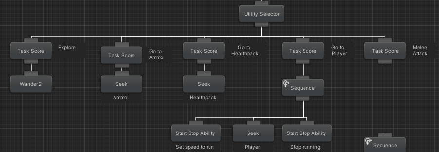
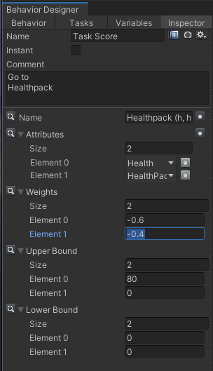
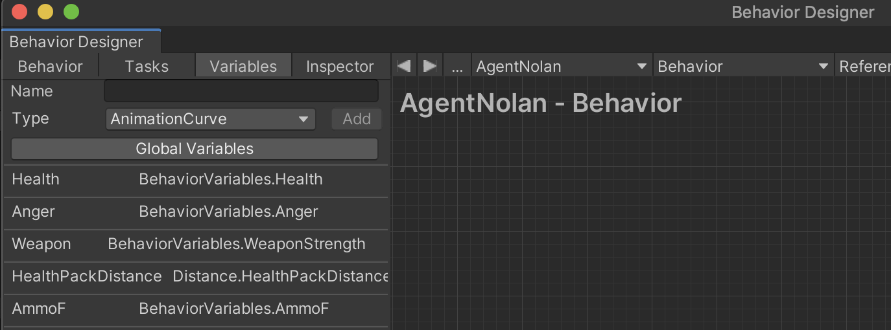

# Task Score
Task Score provides a score for an activity in a Unity game to the Opsive Behavior Designer (BD) Utility Selector based on weighted attributes that you configure. For each activity, you configure which attributes to use and how much to weight each attribute. The BD Utility Selector then runs the activity with the highest Task Score.   For example, a Retrieve HealthPack task could be configured with a high weighting for poor health and a HealthPack being nearby.  As the health rating gets worse, the Retrieve HealthPack score gets higher and if there is a healthpack nearby eventually may become the highest rated task for the Utility Selector.  Using weighted attribute task scores can be easier and provide more natural behavior for an agent's decisions rather than having a complex tree of binary decisions for every case. *NOTE: These components work with Opsive Behavior Designer but are not affiliated with Opsive or supported by Opsive.*

### Table of Contents
**[Overview of Components](#Overview-of-Components)** 
**[Task Score Component](#Task-Score-Component)** 
**[Distance Component](#Distance-Component)** 
**[FPS Variables Component](#FPS-Variables-Component)** 
**[Troubleshooting](#Troubleshooting)** 

# Overview of Components

These three components work together to provide a task score to Behavior Designer Utility Selector:

- *Task Score* - This Behavior Designer Task provides the score for an activity to the BD Utility Selector based on the weights you assign to various attributes. The Utility Selector then runs the activity with the highest score.  Behavior Designer global variables are used as the attributes of the score for a task.
- *Distance* - This script determines if  objects with specific tags are visible (player, healthpack, etc), calculates their distance, and makes their location and distance available as Behavior Designer variables. This also provides an Explore attribute which indicates that few key objects objects have been found and it would be useful to explore.  Distances are normalized from 0 to 100.
- *FPS Variables* - This script makes it easy for Behavior Designer to access variables used in a basic FPS type game, such as: Ammunition amount, Weapon strength, Health, Explore, and Anger level.  This component would be modified to track the scoring attributes specific to your particular game. All variables are normalized from 0 to 100.

Behavior Designer from Opsive is required for Task Score to work.

# *Component Details*  

# Task Score Component

Task Score is a Behavior Designer task which returns the score for a particular activity based on the weights you assign to various attributes.  The Utility Selector will then run the task with the highest score.  Task Score is configured with different attributes and weights for each activity.
  

### Task Scoring Example

In this example for an FPS game, the agent currently has low health and is 30 units from both the player and from the healthpack. The Behavior variables values currently are:  
  
*Health=20, HealthPackDistance=30, PlayerDistance=30*  

We have two tasks to score and decide which to run:  1) Seek Healthpack, and 2) Attack Player.  

*Task Score for “Seek Heathpack”*  
Task Score weights for this were configured to:  Health= -0.6, HealthPackDistance=-0.4  
**Score= 76** = (80 * 0.6) + (70 * 0.4)   (Note the Health score is reversed to 80 because the weight is negative (see Reverse Scale below).  The lower our health, the higher we want the score.  Distance is also reversed to reward being closer, not distant.    
  
*Task Score for “Attack Player”*  
Task Score weights for this were configured to:   Health= 0.6, PlayerDistance=-0.4  
**Score= 40** = (20 * 0.6) + (70 * 0.4)   

In this case, the score for Seek Healthpack is higher than Attack Player.  If Health improved, the score for Attack Player would be higher.  This is a simplified example, in a real score you might also want to include ammo amount, weapon strength, anger, etc.

### Parameters
Any float Behavior Designer global variable can be a component of the task score.   You can set a weighting from 0 to 1.0f for each attribute.  The  score is the sum of each attribute’s weight times the attribute’s value.    To provide a consistent basis for scoring:  
1. All attributes should be scaled from 0 to 100.0f. The scripts in this package already do that for distance and FPS Variables. 
1. The sum of the weights of all the attributes should be equal to 1.0f for a high priority task, 0.9f for medium priority, and 0.8f for a low priority activity.  
Behavior Designer Inspector tab for Task Score for Seek Healthpack.  The second attribute is distance to the healthpack.  Note that an upper bound of 80 is set.  If health is over 80, this will return a score of zero no matter how close we are to a healthpack.  

  

### Reverse Scale
Since the Utility Selector chooses the task with the highest values, you sometimes need to reverse the scale for  an attribute to have it increase utility.  For example, as a player’s health gets lower, you might want to give a higher result for getting a healthpack.  You can do this by assigning a negative weight.  This is handled as a special case that reverses the scale (100-value) and applies the absolute value of the weight.  Use a negative weight on distance when you want the score to be higher when you are closer.  Use a negative weight on health when you want the score to be higher when you are weaker. 

### Upper and Lower Bounds
You can also specify that an attribute MUST be lower than a value or greater than a value.  If the attribute does not fall in those bounds a score of zero is returned regardless of any other attributes.  For example, you can configure that playerDistance must be less than 8 for a Melee attack or else return 0.  Note 1: the bound is checked *without* reversing the scale.  Note 2: Upper bound and lower bounds of zero are ignored.    

### Success Status of Child Task  
**TODO** - This monitors the Success/Failure status of the child activity.  If the child activity fails, the score is reduced for the next N ticks.  For example, a "Flee Player" task is called but the agent cannot move further from player and the task returns fail, or a "Pickup Item" task is called but the Agent is unable to pick up the item.

### Setup  
1. Before setting up this component follow the Setup instructions for the Distance component, and FPS Variables component below.
1. Copy Task Score.cs to your assets folder.
1. In the Behavior Designer edit window, add a Task Score Task for each activity under Utility Selector and connect it to the Utility Selector with the actions connected below it.  Those components will be necessary to provide attributes for scoring.
1. In the BD Inspection window for each Task Score task, add the Global Variables you want for this task and add the weight for each variable. You can also set a "greater than" value and a "less than" value for each attribute.  If the bound is not met, zero is returned for the score. 

# Distance Component  
The distance component tracks the distance from the agent to all objects that have the tags listed in the section below.  
It updates BD Global Variables with the same name (with Distance appended).  
**A tag MUST be applied to game objects you want to track  
For a pickup item, the tag MUST be applied to the item with the pickup script.**  
This component determines if each object is visible by the agent and if visible, that object is considered "found". If an object has not been seen for N seconds *and is not static* (for example the player), the "found" flag is cleared.  The component calculates the distance to all currently "found" objects.  An object tag (e.g. Healthpack) can have multiple objects, and the value will be for the closest object with that tag.   0=close, 100=far. *NOTE: 1000 is returned for not known.*  This is an exception to the 0-100 range guideline and will return very high scores for not found items which will likely make a task using distance to that object very unlikely to run.  A task can also set an upper limit of 100 so it will not run for items that have not been found.

### Tags
The distance component tracks the distance from the agent to all objects that have the tags listed below.  
*healthpack, player, ammo, weapon, ambush*  
*ambush* is used for a location for agents to gather to ambush a player

### Field of Vision  
Rather than having a fixed cutoff for whether an item is either in or out of field of vision, objects toward the center of view are visible further off, and objects off to the side must be closer to be visible.  It also allows marks an item behind you as visible if it is very close.
The actual calculation is the following  

*maxViewableDistance = Mathf.Max(maxDistance - (angle * angleWeight), behindDistance)*  

maxDistance, angleWeight, and behindDistance are configurable in the Inspector. Angle is 0 if object is straight ahead and 90 if object directly to the side.  

### Explore attribute  
This also provides an *Explore attribute* which is based on how many key components haven't yet been found.  The higher this value, the more useful exploring is.    
If a single object is found for the tag, the tag is considered found.  These are the tags tracked for the explore value:   
*healthpack, player, ammo, weapon*

### Distance Variables  
*HealthPackDistance* - 1000=not found, 100=far, 0=near  
*PlayerDistance* - 1000=not found, 100=far, 0=near  
*AmmoDistance* - 1000=not found, 100=far, 0=near  
*WeaponDistance* - 1000=not found, 100=far, 0=near  
*AmbushDistance* - 1000=not found, 100=far, 0=near  
*Explore* - 100=100% of target types unfound, 0=0% of target types unfound.  

### Setup
1. Copy Distance.cs to your assets folder.  
1. Assign the tags listed above to the components you want to track.
1. Add the Distance Component to your Agent.
1. In the Behavior Designer Variables tab, add the Global Variables you want for your project from the Distance Variables listed above.  

# FPS Variables Component  
This Unity component makes it easy to access normalized FPS type variables in Behavior Designer such as:  
*Ammo, MeleeWeapons, RangeWeapons, Health, Anger*  

All variables are provided as floats scaled from 0 to 100.0f.   
This component should be modified to track other types of variables specific to your game. 

### Anger  
This also maintains the Anger score and increases the anger attribute in Attribute Manager whenever the agent receives damage.  The BD Attribute Manager can be configured to decrease anger over time.  The initial value for anger in the Attribute Manager can range from zero for a peaceful agent to 100 for an aggresive agent.  

### FPS Variables
*Health* - 100=healthy, 0=dead  Agent Health   
*Anger* - 100=angry, 0=calm.  Damage to the agent increases anger.  Time decreases anger (based on the rate set in Attribute Manager)   
*MeleeWeapons* - 0 none, 100=most powerful weapon.  Power of equipped weapon. For example: 40 Club, 60 Knife, 65 Sword.  
*RangeWeapons* - 0 none, 100=most powerful weapon.  Power of equipped weapon. For example:  75 Pistol, 85 Assault Rifle 95 Rocket Launcher.      
*Ammo* - 100=full, 0=empty.  Note: this is the percent of "adequate" ammunition, not the number of bullets.  A rocket launcher with 12 rockets would return a score of 100.  An assault rifle with 12 bullets would return a score of 5.

### Setup  
1. Add the FPS Variables Component to your agent.
1. Set the Anger increment value for a damage attack in the Inspector.
1. In the BD Variables tab, add the Global Variables you need for your project from the FPS Variables list above.  
1. Add an Anger attribute to your agent’s Attribute Manager with min/max of 0,100 and set auto decrement (if you choose).  Set the initial value to zero for a passive agent and to 100 for an aggresive agent or any value in between.  

# Troubleshooting  
1. In the Behavior Designer Inspector for the Task Score task, enable the magnifying glass on "Sc".  This will display the realtime value of the task score on the behavior diagram.
1. All the game objects you want to track must have a tag (weapon, player, healthpack, etc) for the distance calculator.  Make sure the player is tagged, healthpacks are tagged, weapons are tagged.  The weapon names must match a name listed in WeaponDict in FPSVariables.cs.
1. Use a Reverse Scale (negative weight) if you want a high score for a *close* distance, *weak* health etc.  **Almost all items will use negative weights.** Double check any items with positive weight.
1. Set upper/lower bounds for scores where appropriate.  For example, attack player should have a minimum ammo greater than zero.  With zero ammo it will generate a very low score but that might still be the best score available.  
1. The sum of the weights should be equal to 1.0f for a high priority task, 0.9f for medium priority, and 0.8f for a low priority activity.  
1. The action under a task, MUST end up altering at least one of the scores for that task otherwise you will get stuck running the same task.
1. Make sure that Seek and Flee have been set up to have correct targets.
1. You should have one Task which will run when everything else has a low score. This task should not have any upper or lower bounds.
1. **TODO** Use the spreadsheet below to determine optimal weights.  The spreadsheet allows you to enter all the tasks and will calculate their score as you change variable values.
